# Layout inventory — Momentum Presentation template

Canonical template: [Momentum Presentation Templates — Local Source File](https://www.figma.com/design/6H5CByIMGf2FZ9rGVYnQnn/Momentum-Presentation-Templates---Local-Source-File?node-id=0-1) (`6H5CByIMGf2FZ9rGVYnQnn`).

Use the **`layout`** column value in `deck-manifest.yaml` (`layout: "<id>"`).

## Defaults (cross-cutting)

- **Footer (when present):** Copyright notice with the **current presentation year** and the authoring organization. Unless the user specifies otherwise, use organization **Collaboration Design**.
- **Presentation dates:** Prefer **Month DD, YYYY** (e.g. `July 4, 2026`). If the user asks for less specificity, use forms like `July 2026` or `Q3 2026`.

## Quick reference

| # | Layout name | `layout` id |
|---|----------------|---------------|
| 1 | Title slide | `title-slide` |
| 2 | Agenda slide | `agenda` |
| 3 | Section divider | `section-divider` |
| 4 | Statement | `statement` |
| 5 | Tile slide | `tile-slide` |
| 6 | Full image slide | `full-image-slide` |
| 7 | Empty with title | `empty-with-title` |
| 8 | Content, single column left | `content-single-column-left` |
| 9 | Content, single column right | `content-single-column-right` |
| 10 | Content, single column full width | `content-single-column-full-width` |
| 11 | Content, two columns | `content-two-columns` |
| 12 | Content, three columns | `content-three-columns` |
| 13 | Conclusion slide | `conclusion-slide` |

### Template screenshots

PNG exports from the live template live alongside this file in [`assets/`](assets/). Paths below are relative to `layout-inventory.md`.

---

## 1. Title slide — `title-slide`

**Purpose:** Almost always the **first slide**: main metadata for the presentation (title, presenter, date).

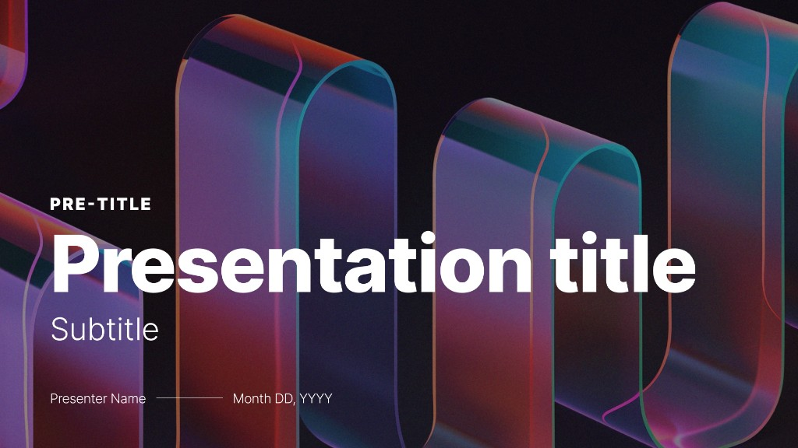

*Example:* Dark canvas with abstract translucent ribbon artwork; primary text block lower-left (pre-title, main title, subtitle, presenter / date). Other title variants use flat black backgrounds—see additional content layouts as needed.

**Variants / fields**

| Slot | Required | Notes |
|------|----------|--------|
| Pre-title | Optional | Over-arching theme (e.g. `Design review`, `Quarterly goals`). |
| Title | **Required** | Main title for the entire deck; describes overall subject matter. |
| Sub-title | Optional | Supporting text for the presentation title. |
| Presenter name | Optional | Up to **five** names, or a group/team name. |
| Date | Optional | Prefer **Month DD, YYYY**. May generalize (e.g. month+year, quarter) if the user requests. |

---

## 2. Agenda slide — `agenda`

**Purpose:** Often follows the title slide; previews **sections or stages** that match the structure of slides later in the deck.

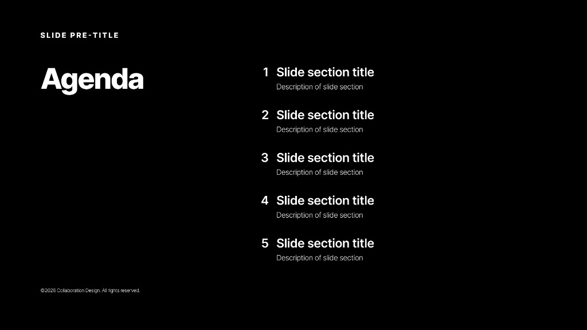

*Example:* Black background; optional **slide pre-title** top-left; large **Agenda** label left; numbered sections with titles and optional descriptions on the right; footer © year **Collaboration Design**.

**Variants / fields**

| Slot | Required | Notes |
|------|----------|--------|
| Pre-title | Optional | May match the title slide pre-title, or echo the deck title. |
| Footer | Optional | Copyright + year + org (default **Collaboration Design**). |
| Agenda topics | **Required** | Numbered **1 … N**; **N** equals the number of major sections in the deck. Each item may have an optional **subtitle** describing it. **Consistency:** if any section uses a subtitle, **all** should use subtitles. |

---

## 3. Section divider — `section-divider`

**Purpose:** Interstitial / transition before a **new section**; aligns with agenda topics and with content until the next section divider.

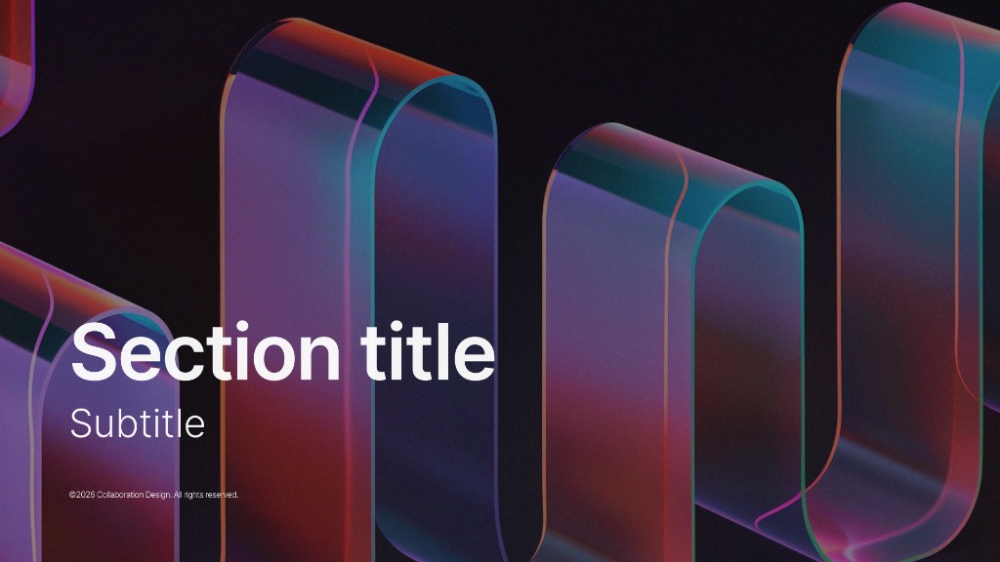

*Example:* Matches title-slide ribbon aesthetic; prominent **Section title** and optional **Subtitle** lower-left; optional footer.

**Variants / fields**

| Slot | Required | Notes |
|------|----------|--------|
| Section title | **Required** | Should align with the agenda label for that section (small wording tweaks OK for fit). |
| Subtitle | Optional | Should align with the agenda subtitle if used (small variations OK). |
| Footer | Optional | Copyright + year + org (default **Collaboration Design**). |

---

## 4. Statement — `statement`

**Purpose:** Use **sparingly** for a short, strong insight or quote. **Do not use two Statement slides in a row.**

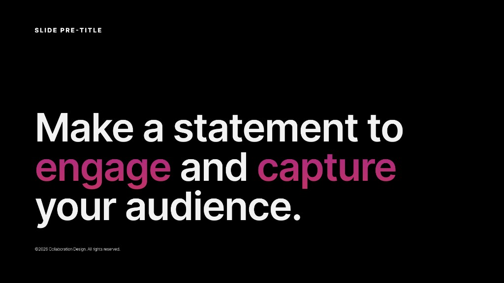

*Example:* Optional **slide pre-title** top-left; large statement with selective accent color on key phrases; optional footer.

**Variants / fields**

| Slot | Required | Notes |
|------|----------|--------|
| Slide pre-title | Optional | When used: **name of the current section** this slide sits in. |
| Statement | **Required** | Large emphasis text. |
| Footer | Optional | Copyright + year + org (default **Collaboration Design**). |

---

## 5. Tile slide — `tile-slide`

**Purpose:** Present multiple options/categories and highlight an area of importance. May appear **in succession** to walk through each highlighted tile in order.

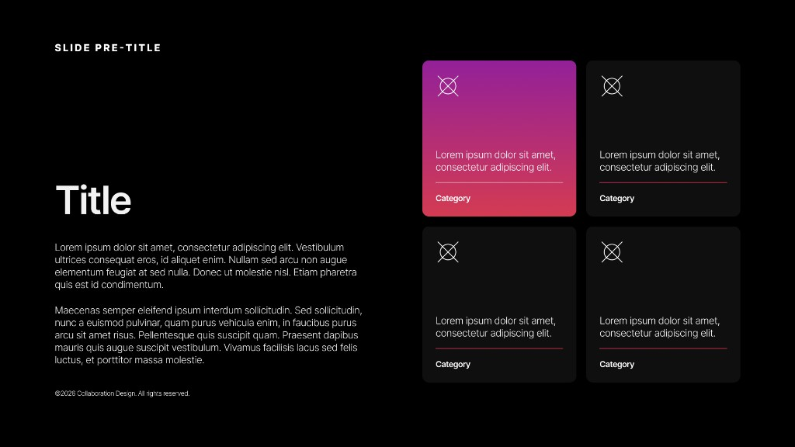

*Example:* Pre-title, title, body on the left; **2×2** tiles on the right (icon, body, divider, category label); one tile may use gradient **focus** styling; footer optional.

**Variants / fields**

| Slot | Required | Notes |
|------|----------|--------|
| Slide pre-title | Optional | When used: **section name** for this slide. |
| Title | **Required** | Slide title / subject. |
| Body | Optional | Supporting description for the slide. |
| Tiles | **Required** | **2–4** items. Each tile: optional **icon** (top-left), **bold title** at bottom, **body** above the title, separated by a divider. Tiles may be **rest** or **focused**: all four may be rest, or **exactly one** focused—never more than one focused. |
| Footer | Optional | Copyright + year + org (default **Collaboration Design**). |

---

## 6. Full image slide — `full-image-slide`

**Purpose:** One or more **large** images occupying most of the slide.

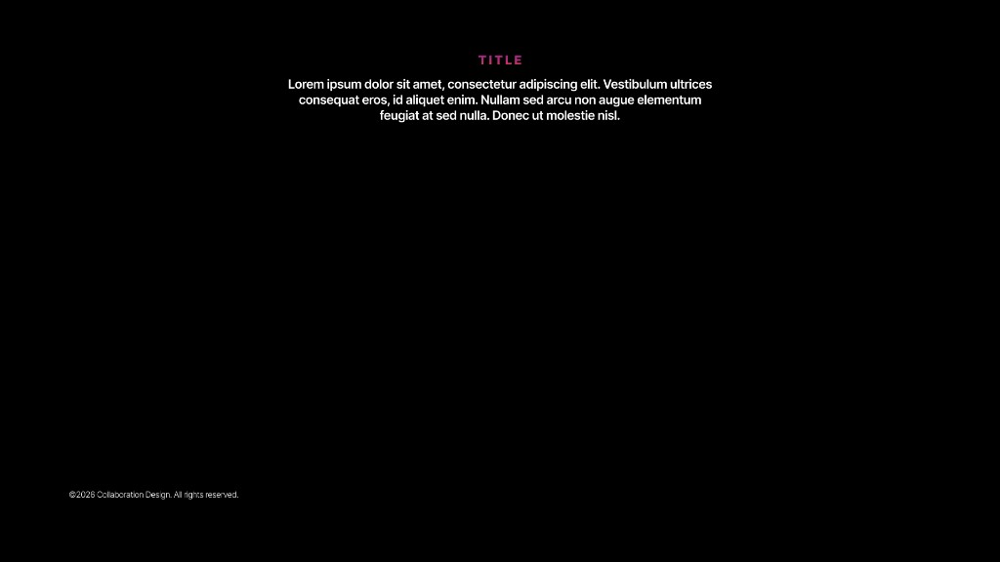

*Example:* Top-centered optional label + supporting copy; **image area** dominates the frame in production decks (placeholder shows typography-only treatment).

**Variants / fields**

| Slot | Required | Notes |
|------|----------|--------|
| Title | Optional | Introduces the image(s). |
| Body text | Optional | Short supporting copy only (**few sentences max**). |
| Footer | Optional | Copyright + year + org (default **Collaboration Design**). |

---

## 7. Empty with title — `empty-with-title`

**Purpose:** Flexible canvas: one or more images of any size, other media, or layouts that don’t fit other masters.

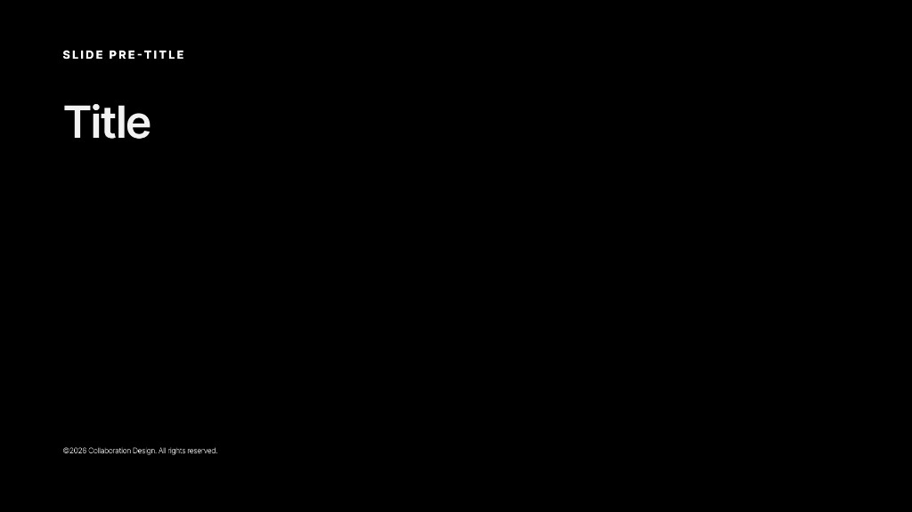

*Example:* Pre-title, **Title**, generous empty space for media; footer optional.

**Variants / fields**

| Slot | Required | Notes |
|------|----------|--------|
| Slide pre-title | Optional | When used: **section name**. |
| Title | **Required** | Describes the page content. |
| Footer | Optional | Copyright + year + org (default **Collaboration Design**). |

---

## 8. Content, single column left — `content-single-column-left`

**Purpose:** General content; strong when **~half** the slide is image plus title and description. Interchangeable with layouts **8–12**; **alternate** left/right/full/two/three for variety.

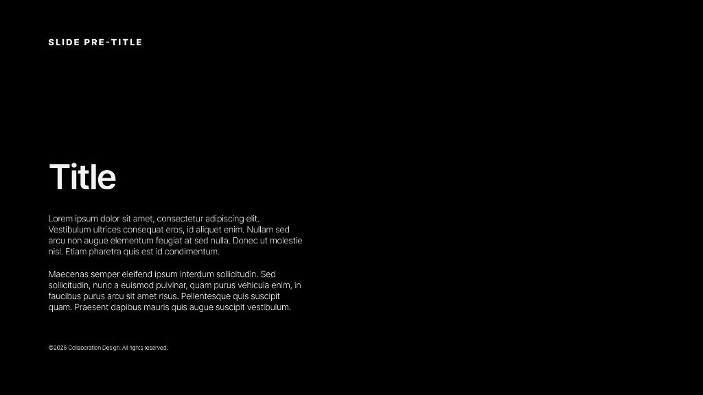

*Example:* Pre-title, title, body block **left** (media typically occupies the opposite half).

**Variants / fields**

| Slot | Required | Notes |
|------|----------|--------|
| Slide pre-title | Optional | When used: **section name**. |
| Title | **Required** | Describes the slide. |
| Body | Optional | Supporting detail. |
| Footer | Optional | Copyright + year + org (default **Collaboration Design**). |

---

## 9. Content, single column right — `content-single-column-right`

**Purpose:** Same use case as single column left, with media on the other side. **Alternate** with left (and other content layouts) to reduce monotony.

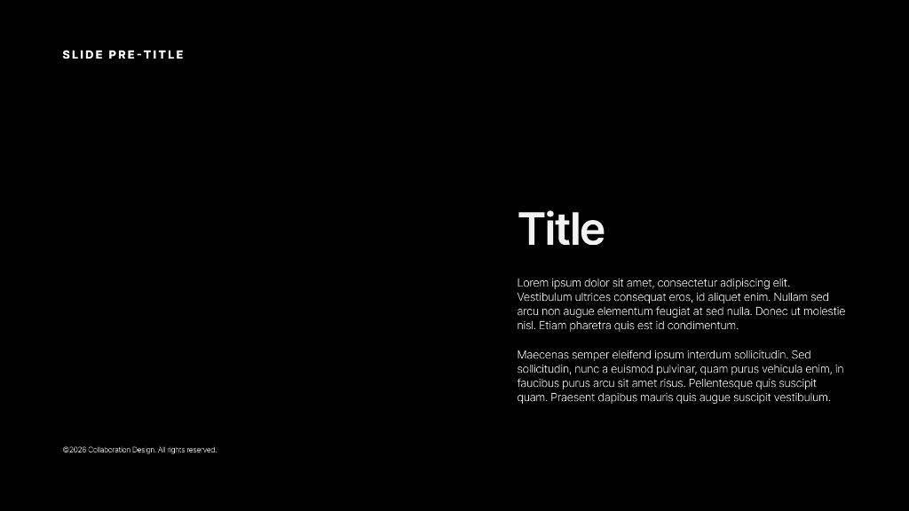

*Example:* Same structure as left variant; primary title/body block anchored **right** for visual alternation.

**Variants / fields**

| Slot | Required | Notes |
|------|----------|--------|
| Slide pre-title | Optional | When used: **section name**. |
| Title | **Required** | Describes the slide. |
| Body | Optional | Supporting detail. |
| Footer | Optional | Copyright + year + org (default **Collaboration Design**). |

---

## 10. Content, single column full width — `content-single-column-full-width`

**Purpose:** General content **without** a dominant image, or with a **small** image that doesn’t compete with text; good for **dense text**.

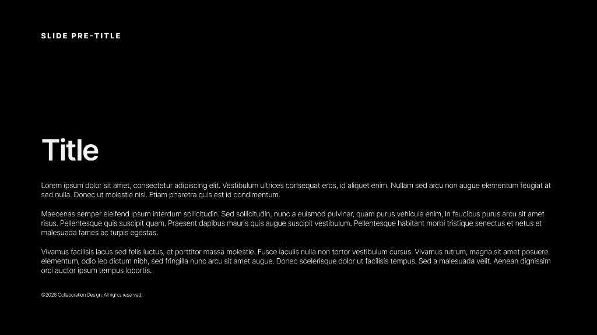

*Example:* Pre-title, title, **multi-paragraph** body spanning the content width.

**Variants / fields**

| Slot | Required | Notes |
|------|----------|--------|
| Slide pre-title | Optional | When used: **section name**. |
| Title | **Required** | Describes the slide. |
| Body | **Required** | Supporting detail. |
| Footer | Optional | Copyright + year + org (default **Collaboration Design**). |

---

## 11. Content, two columns — `content-two-columns`

**Purpose:** **Two** parallel ideas side by side (compare/contrast). Small non-intrusive images optional; image not required.

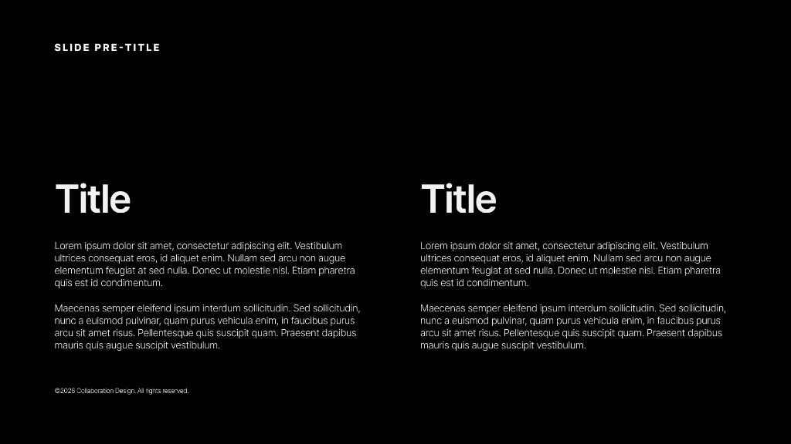

*Example:* Shared pre-title; two columns each with **Title** + body copy.

**Variants / fields**

| Slot | Required | Notes |
|------|----------|--------|
| Slide pre-title | Optional | When used: **section name**. |
| Title 1 | **Required** | First subject. |
| Body 1 | **Required** | Detail for title 1. |
| Title 2 | **Required** | Second subject. |
| Body 2 | **Required** | Detail for title 2. |
| Footer | Optional | Copyright + year + org (default **Collaboration Design**). |

---

## 12. Content, three columns — `content-three-columns`

**Purpose:** **Three** parallel subjects (rarer). Small supporting images optional per column.

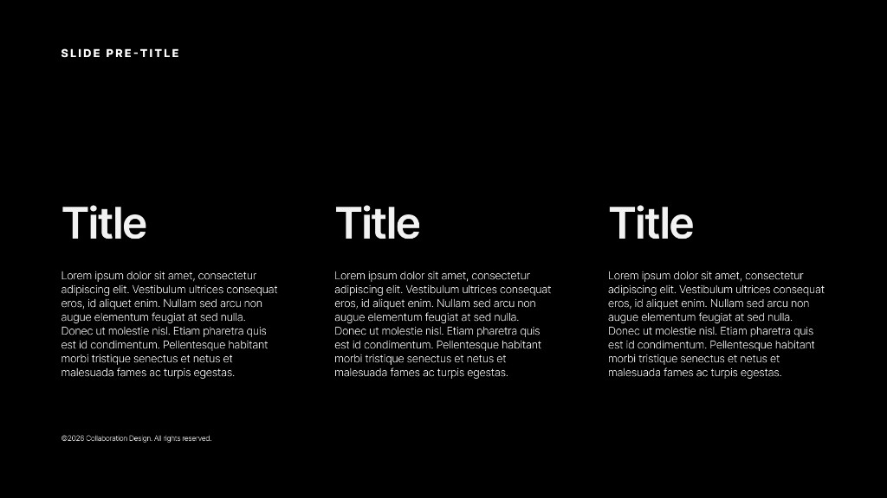

*Example:* Shared pre-title; three equal columns (**Title** + body each).

**Variants / fields**

| Slot | Required | Notes |
|------|----------|--------|
| Slide pre-title | Optional | When used: **section name**. |
| Title 1 | **Required** | First subject. |
| Body 1 | **Required** | Detail for title 1. |
| Title 2 | **Required** | Second subject. |
| Body 2 | **Required** | Detail for title 2. |
| Title 3 | **Required** | Third subject. |
| Body 3 | **Required** | Detail for title 3. |
| Footer | Optional | Copyright + year + org (default **Collaboration Design**). |

---

## 13. Conclusion slide — `conclusion-slide`

**Purpose:** **Closing slide** so the deck does not end on a body content layout. Large salutation text.

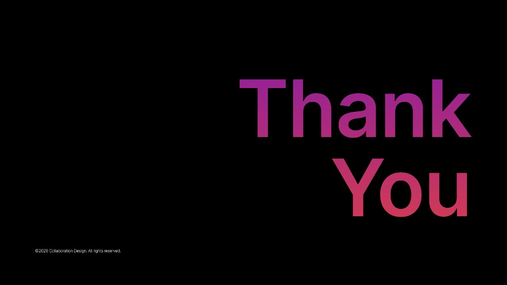

*Example:* Large **Thank you** (or similar) with gradient treatment, **right-aligned**; footer © **Collaboration Design** bottom-left.

**Variants / fields**

| Slot | Required | Notes |
|------|----------|--------|
| Salutation | **Required** | e.g. `Thank you`, `Questions?`, or another closing line. **Default salutation:** `Thank you`. |
| Footer | Optional | Copyright + year + org (default **Collaboration Design**). |

---

## Composition notes (for agents)

- **Agenda ↔ deck:** Agenda section count and labels should match **section dividers** and the blocks of slides that follow until the next divider.
- **Content variety:** Rotate among **`content-single-column-left`**, **`content-single-column-right`**, **`content-single-column-full-width`**, **`content-two-columns`**, **`content-three-columns`** intentionally across the deck body.
- **Statement discipline:** Avoid **back-to-back** `statement` slides.
- **Closing:** Prefer ending with **`conclusion-slide`** after final content, not on a raw content slide.
